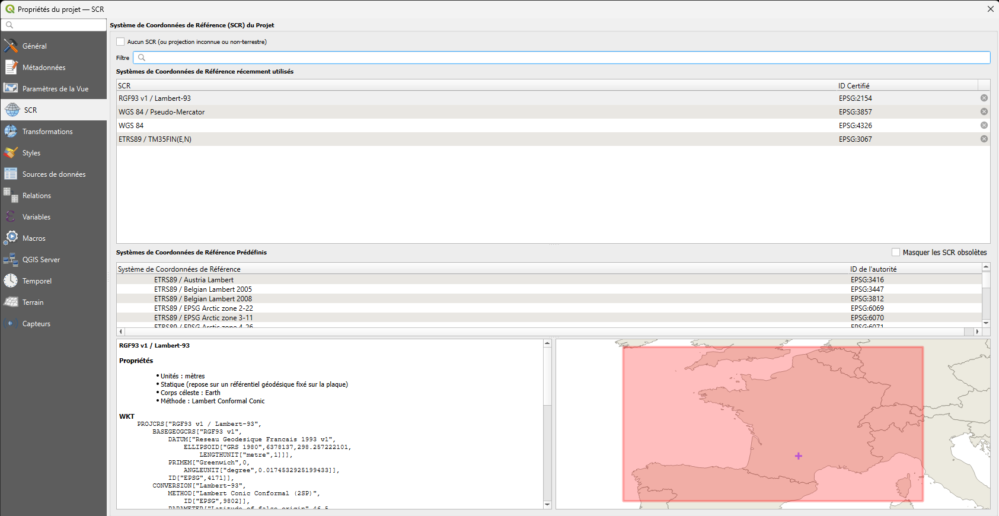

# Plan du cours

Illustrations dédiées à la séquence et manipulations en mode CLI.

## Introduction SIG

[Lien du cours](https://supports.idgeo.fr/intra/alteia/co/perso_intro_alteia.html)

**Définition**

- La représentation du monde réel

- Le passage du monde réel au mon de représenté (le plan)

- la gestion des données, des géodonnées avec des machines (infrastructure) et des humains (et de l'IA)

Les SIG pour valoriser les géodonnées :

>Les formats de données :

- les Rasters

- Les vecteurs

>Les représentations :

- Modélisation du monde réel
	
- Analyses spatiales et représentations


## Les projections

[Liens cours](https://supports.idgeo.fr/intra/alteia/co/perso_intro_alteia_3.html)

> Des liens supplémentaires

[Dogeo](https://projection.dogeo.fr/#/point-to-coords)


[https://epsg.io/map](https://epsg.io/map)


> QGIS



> La vraie taille

[https://www.thetruesize.com/](https://www.thetruesize.com/)


> Les hommes carte

[https://www.youtube.com/watch?v=jtBV3GgQLg8&list=PLfxy4_sBQdxy3A2lvl-y3qWTeJEbC_QCp&index=9](https://www.youtube.com/watch?v=jtBV3GgQLg8&list=PLfxy4_sBQdxy3A2lvl-y3qWTeJEbC_QCp&index=9)

### Des exemples par la Pratique


*Les données sont à récupérer sur le réseau*


### Manipulations sur les projections

**Exercice 1**: Absence de projection définie

- Problème : Ouvrez le fichier Shapefile des départements du dossier projection, mais il n’a pas de système de coordonnées défini. 
	Lorsque vous l’ouvrez dans QGIS, il ne s’aligne pas correctement avec d’autres couches.

- Objectif : Identifier et définir le système de coordonnées correct.

**Tâche** :

   - Utiliser les métadonnées ou une comparaison avec d’autres données pour deviner la projection d’origine.
	
```bash
ogrinfo DEPARTEMENT.shp DEPARTEMENT -geom=NO
```	

```bash
ogrinfo REGION.shp REGION -geom=NO
```	

**Indice** : OGRINFO renvoie l'extent de la donnée avec les coordonnées exprimées dans le SCR de la couche.

```bash
ogr2ogr -a_srs EPSG:2154 REGION_2154.shp REGION.shp
```	


**Exercice 2**: Mes données sont mal poisitionnées

- Importer le fichier trace_velo.csv

- Qu'est-ce qu'on constate ?

--------------

## Pratique des outils en ligne de commande / Illustration QGIS

Depuis debian WSL2 pour contexte linux.


### GDAL - La librairie des rasters


```bash
0...10...20...30...40...50...60...70...80...90...100 - done
```

Travail avec 4 images Ortho Toulouse centre historique Toulouse + une dalle éloignée


#### Information sur le Raster

> gdalinfo


```bash
gdalinfo ORT_2022_1574165_2269250.jp2
```

> gdalinfo sortie json

```bash
gdalinfo -json ORT_2022_1574165_2269250.jp2 > gdalinfo_ORT1.json
```


#### VRT

> Création d'un vrt

```bash
gdalbuildvrt assemble.vrt *.jp2
```
> vrt du mnt Aveyron

```bash
gdalbuildvrt BDALTI_12.vrt *.asc
```

> Gestion du nodata avec l'option srcnodata

```bash
gdalbuildvrt -srcnodata "0" assemble_srcnodata.vrt *.jp2
```


#### Changer de format

> Conversion d'un jp2 en tif

> [!WARNING]
> [Attention - Opération longue](#){.btn .btn-warning}

```bash
gdal_translate -of GTiff ORT_2022_1572415_2268000.jp2 ORT_2022_1572415_2268000.tif
```

#### Reprojection d'un raser

> Reprojection du 3943 au 4326

```bash
gdalwarp -s_srs EPSG:3943 -t_srs EPSG:4326 ORT_2022_1572415_2268000.jp2 ORT_2022_1572415_2268000_4326.jp2
```

> Reprojection du 3943 au 4326 avec gestion de la transparence :+1:

```bash
gdalwarp -s_srs EPSG:3943 -t_srs EPSG:4326 -dstalpha ORT_2022_1572415_2268000.jp2 ORT_2022_1572415_2268000_4326.jp2
```

> Oscultons le VRT 

Ligne 2 :

- SRS dataAxisToSRSAxisMapping="1,2"-PROJCS["RGF93 v1 / CC43"]

> Tentons de reprojeter ce VRT
```bash
gdalwarp -s_srs EPSG:3943 -t_srs EPSG:4326 -dstalpha assemble.vrt assemble_4326.vrt
```

On constate juste un changement et une rapidité d'éxécution incomparable
- SRS dataAxisToSRSAxisMapping="2,1">GEOGCS["WGS 84",DATUM["WGS_1984"]

#### Assembler des Rasters

```bash
gdal_merge 
```

```bash

```

#### Découper un Raster

> avec une emprise

```bash

```

> avec un vecteur

```bash

```

### OGR  - La librairie des vecteurs

> ogrinfo (métadonnées)
```bash

```
> ogr2ogr : repojection ou changement de format
```bash

```

```bash

```

Le cas des MNT
---------

[./readme_gdal_mnt.md](readme_gdal_mnt.md)

Les données LIDAR - LASTools
---------
[./readme_lidar.md](readme_lidar.md)

Les données LIDAR - PDAL
---------
[./readme_pdal.md](readme_pdal.md)


