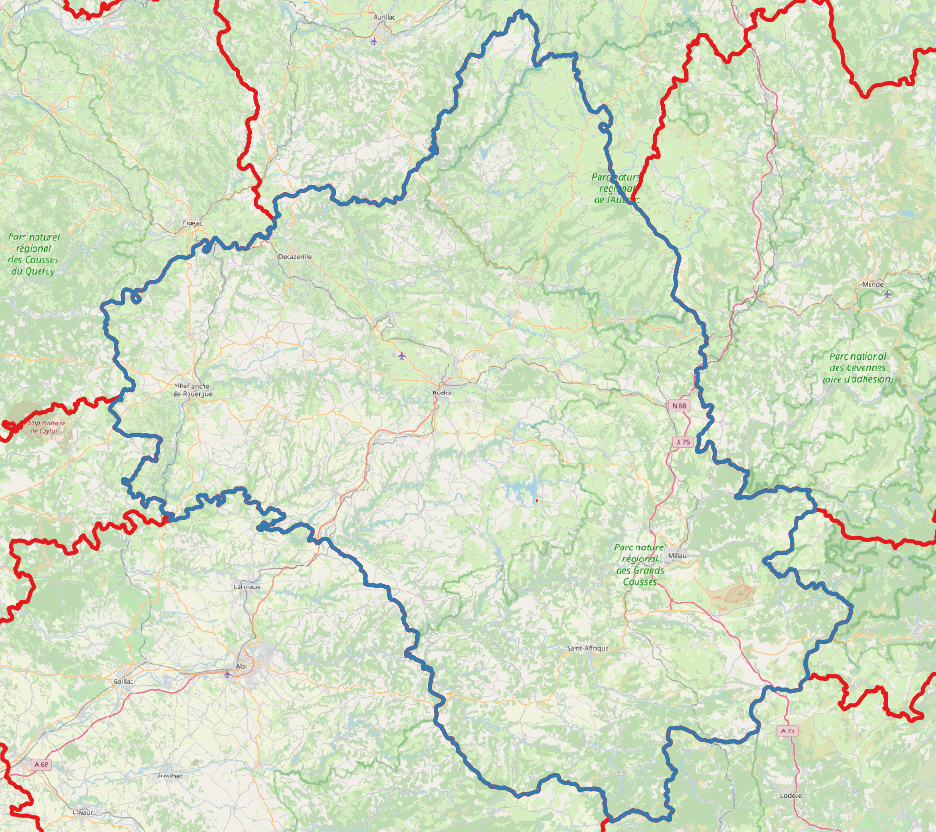
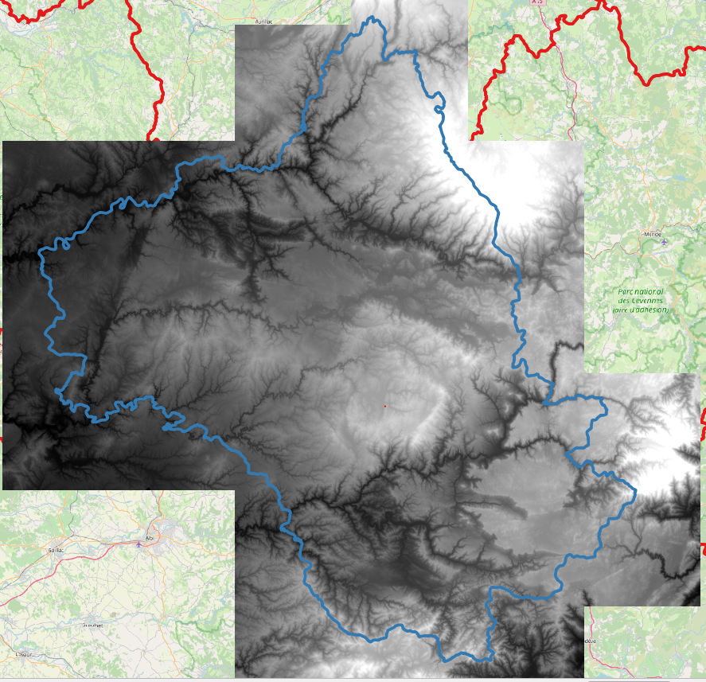
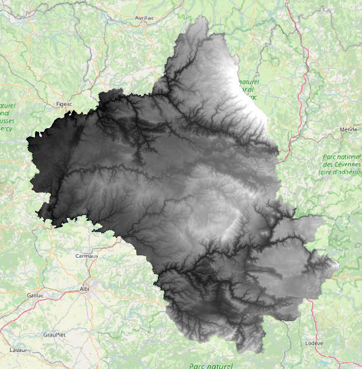
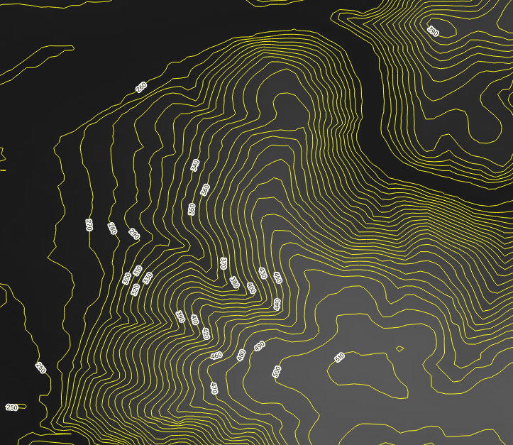
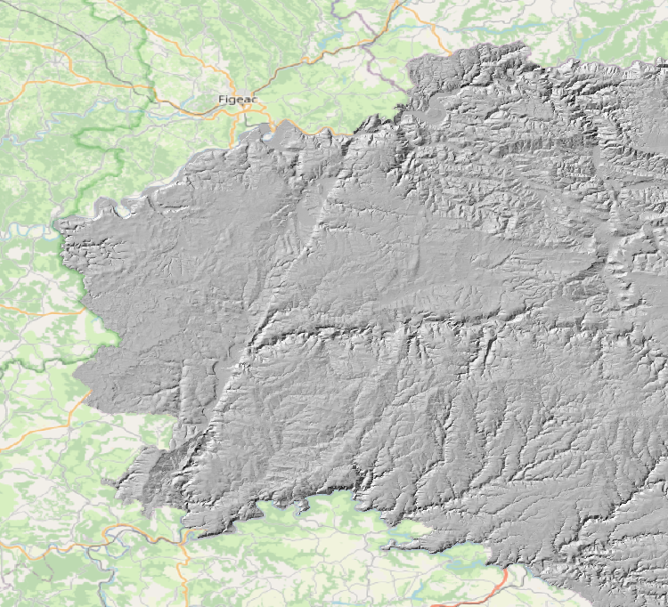
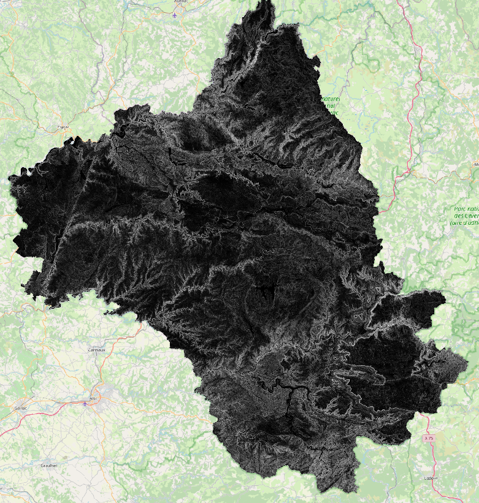
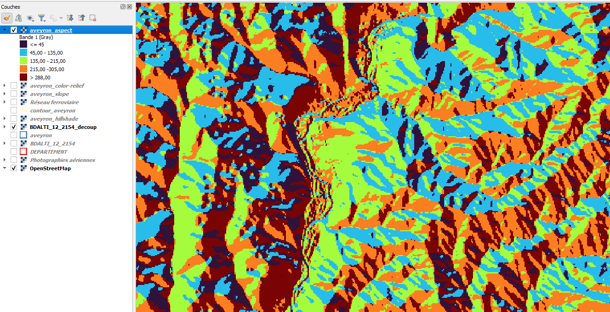
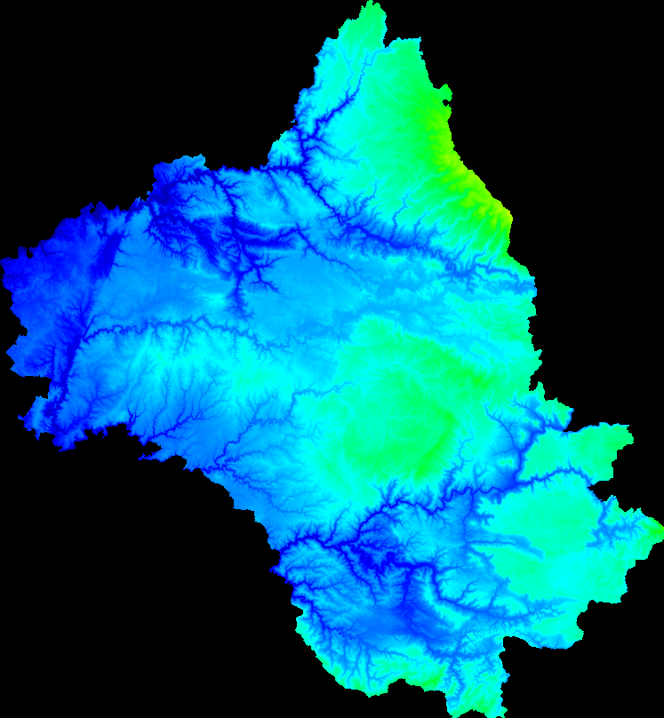

## Le cas des MNT

Exemple de manipulations de modèles numérique de terrain avec GDAL.

### Manipulation Aveyron

- Récupération des données BDALTI, shape departement

wget

```bash
wget https://data.geopf.fr/telechargement/download/BDALTI/BDALTIV2_2-0_25M_ASC_LAMB93-IGN69_D012_2022-09-29/BDALTIV2_2-0_25M_ASC_LAMB93-IGN69_D012_2022-09-29.7z
```
unzip (7z à installer certainement)

- Qu'est-ce qu'on cherche à faire ? 

=> Découpage de raster par vecteur, on prépare et on contrôle pour obtenir le résultat.

=> Opération spatiale = **même SRC** pour toutes les données

> On crée un raster virtuel vrt du mnt Aveyron à partir de tous les fichiers ASC, plus facile à manipuler.

```bash
 gdalbuildvrt -a_srs EPSG:2154 mnt12/BDALTI_12_2154.vrt mnt12/*.a 
```

> On extrait le polygon de l'Aveyron qui nous intéresse

```bash
ogr2ogr -where "INSEE_DEP = '12'" vecteur/aveyron.shp vecteur/DEPARTEMENT.shp
```



> On vérifie que le nouveau vecteur est bien dans la projection Lambert 93

```bash
ogrinfo -ro -geom=NO vecteur/aveyron.shp aveyron
```


> On découpe le vrt par le vecteur aveyron.shp

```bash
gdalwarp -overwrite -s_srs EPSG:2154 -t_srs EPSG:2154 -of VRT -cutline vecteur/aveyron.shp -cl aveyron -crop_to_cutline mnt12/BDALTI_12_2154.vrt mnt12/BDALTI_12_2154_decoup.vrt
```



> un coup d'oeil aux stats de l'image (QGIS écrase l'échelle min / max)

```bash
gdalinfo mnt12/BDALTI_12_2154_decoup.vrt -stats
```

> **gdal_contour** Création d'un vecteur de contour (espacé de 10 m)

```bash
gdal_contour -a elev ../mnt12/BDALTI_12_2154_decoup.vrt contour_aveyron.shp -i 10.0
```



> **gdal_dem** 

- Hillshade : Ombrage

```bash
gdaldem hillshade ../mnt12/BDALTI_12_2154_decoup.vrt aveyron_hillshade.tif
```



- slope : Calcul de pente exprimée en % (-p, sion exprimée en degré)

```bash
gdaldem slope -p ../mnt12/BDALTI_12_2154_decoup.vrt aveyron_slope_p.tif
```


- aspect : renvoie un angle trigonométrique au lieu de l’azymuth. Donc 0° signifie l’Est, 90° le Nord, 180° l’Ouest et 270° le Sud.

```bash
 gdaldem aspect  -trigonometric ../mnt12/BDALTI_12_2154_decoup.vrt aveyron_aspect.tif
```



- color-relief -> établir color.txt !

```bash
gdaldem color-relief ../mnt12/BDALTI_12_2154_decoup.vrt color.txt aveyron_color-relief.tif
```
