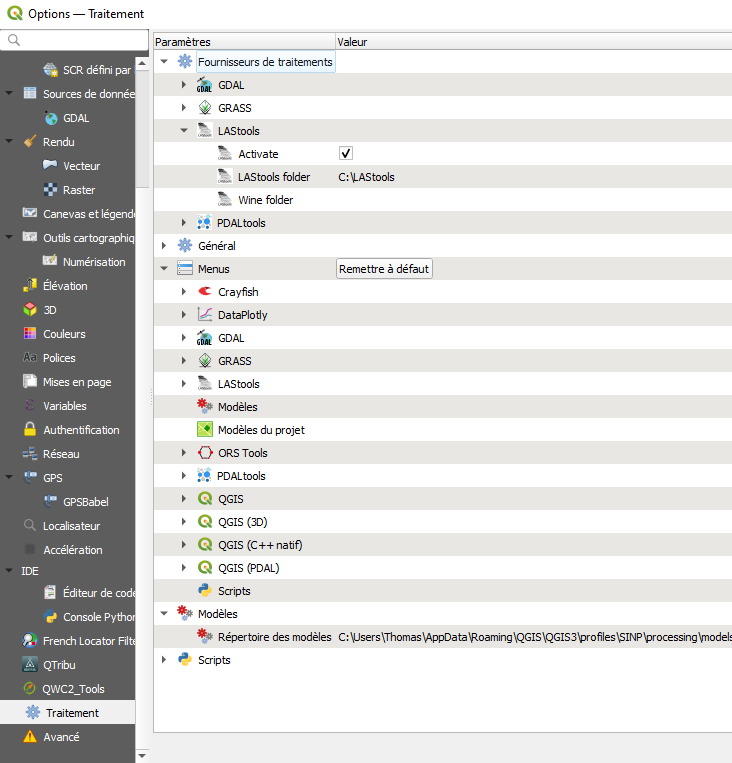

## Lastools - LAS / LAZ

### Définition

Librairie pour utilisation des données LIDAR.

Format LAS. LAZ compressé.

Partie de la librairie capable de traiter les données LAS bas niveau.

Certains outils sont Open source et d'autres sont sous licence.

### Installation

sur Windows :

1.    create directory "c:\lastools"
2.    unzip LAStools.zip to this directory
3.    run the LAStools executables

En parallèle, installer le plugin sur QGIS. Redémarrer QGIS et paramétrer Préférences > Option

#### Ressources

https://github.com/LAStools/LAStools
https://lastools.github.io/

https://rapidlasso.de/product-overview/

https://rapidlasso.de/lastools-as-qgis-plugin/

https://www.sigterritoires.fr/index.php/qgis-pour-lidarmodele-numerique-de-terrain-mnt-avec-lastools/